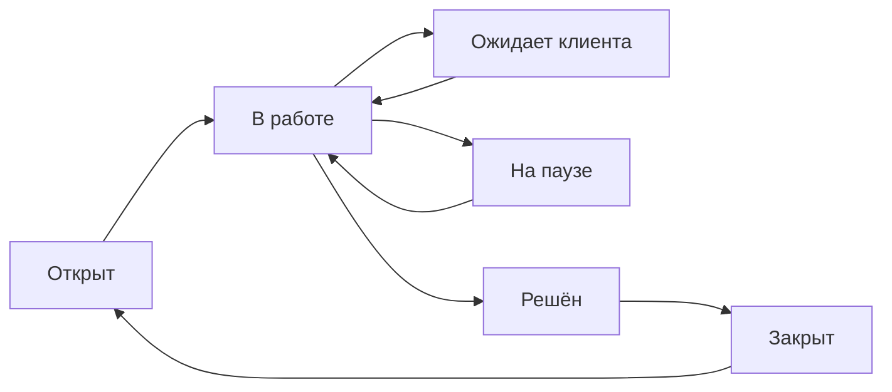

Раздел поддержки помогает распределять обращения между сотрудниками, контролировать сроки ответа и сохранять всю историю работы по каждому клиенту. 

## Как устроена работа

Клиент создаёт обращение через Mini App, а оператор при необходимости может завести тикет вручную. Тикет попадает в очередь, при необходимости назначается сотруднику, проходит по статусам и после завершения получает оценку клиента.

Система сохраняет историю статусов, сообщений, назначений, передач между очередями, заметок и оценки клиента.

## Статусы тикета

| Статус | Что означает | Когда использовать |
| --- | --- | --- |
| **Открыт** | Обращение ждёт, пока его возьмут в работу | Новый или возвращённый в общий пул тикет |
| **В работе** | За тикетом закреплён оператор, который разбирается в вопросе | Оператор начал обработку или клиент ответил на сообщение |
| **Ожидает клиента** | Команда дала ответ и ждёт уточнения или подтверждения | После ответа оператора клиенту |
| **На паузе** | Работа временно приостановлена | Нужна информация от внешней команды, партнёра или сервиса |
| **Решён** | Решение предоставлено, остаётся время на реакцию клиента | Вопрос закрыт по сути, но вы хотите оставить окно для ответа |
| **Закрыт** | Работа по обращению завершена | Финальная точка; клиент не может отправить новое сообщение в этот тикет |

Ответ клиента возвращает незакрытый тикет в статус **«В работе»**. Сообщение оператора переводит тикет в **«Ожидает клиента»**. Закрытый тикет при необходимости можно открыть заново как новое обращение в работу.

### Автоматическое закрытие

Для статусов **«Ожидает клиента»** и **«Решён»** задаётся отдельный срок автоматического закрытия в настройках процесса поддержки. Новый ответ или смена статуса сбрасывает соответствующий таймер.

Статус **«На паузе»** не закрывается по этому таймеру. Используйте его только там, где команда осознанно контролирует возврат к работе.

## Очереди: разделите поток обращений

Очередь — это направление поддержки, например «Оплата», «Технические вопросы», «Корпоративные клиенты» или «Партнёры».

Для каждой очереди настройте:

- название, описание, цвет и иконку для команды;
- понятное клиенту название — например «Проблема с оплатой»;
- видимость для клиентов: если включена, клиент выбирает очередь при создании обращения;
- роли, которые могут видеть и обрабатывать тикеты очереди;
- основной маршрут: одна очередь должна быть назначена по умолчанию;
- способ автоматического назначения и список операторов для ротации.

Создавать и редактировать очереди можно в **Настройки поддержки**. Не отключайте очередь, пока в ней есть неразобранные обращения: сначала передайте их в рабочее направление.

## Как назначать сотрудников

Есть три режима для каждой очереди:

| Режим | Как работает | Когда выбрать |
| --- | --- | --- |
| **Без автоназначения** | Тикет остаётся в общем пуле, пока его не возьмут вручную | Небольшая команда или ручная триаж-схема |
| **По кругу** | Система по очереди назначает тикеты операторам на смене | Нагрузка примерно одинаковая, нужна простая справедливая ротация |
| **По минимальной нагрузке** | Новый тикет получает оператор с наименьшим числом активных обращений | Вопросы отличаются по сложности и длительности |

В ротацию включайте только сотрудников, которые имеют доступ к этой очереди и право отвечать клиентам. В расчёт попадают только операторы, вышедшие на смену.

::: tip
Для первой линии обычно подходит распределение по кругу. Для экспертной команды, где тикеты могут занимать часы или дни, чаще удобнее режим минимальной нагрузки.
:::

## Роли сотрудников

Настройте роли по обязанностям, а не выдавайте всем одинаковый полный доступ.

| Роль в процессе | Что ей нужно разрешить |
| --- | --- |
| **Оператор** | Просматривать обращения и отвечать клиентам в своих очередях |
| **Старший смены** | Назначать и снимать назначение, брать тикеты в работу, следить за очередью |
| **Эксперт / вторая линия** | Работать в своей очереди и получать эскалации |
| **Руководитель поддержки** | Смотреть отчёты, управлять назначениями и эскалациями |
| **Администратор процесса** | Настраивать очереди, роли, ротации, статусы и сроки закрытия |

Необходимые права в редакторе ролей соответствуют этим действиям: просмотр и ответы в поддержке, управление назначениями, эскалация, отчёты и управление ротацией очередей.

## Смена оператора

Перед началом работы оператор нажимает **«Выйти на смену»**. После этого он участвует в автоназначении и видит длительность текущей смены.

При завершении смены система не оставляет активные тикеты за ушедшим сотрудником:

- тикеты в работе передаются следующему доступному оператору той же очереди, если настроена ротация;
- если замены нет, тикет возвращается в общий пул;
- тикеты, ожидающие клиента или находящиеся на паузе, освобождаются без смены очереди.

После завершения смены оператор и руководитель видят итог: длительность, количество обработанных обращений, ответов, решённых и закрытых тикетов, а также переданных или возвращённых в очередь.

## Назначение, передача и эскалация

Эти действия решают разные задачи:

- **Взять тикет** — оператор закрепляет обращение за собой. Первый ответ оператора также автоматически закрепляет тикет за ним.
- **Переназначить** — старший смены передаёт тикет конкретному сотруднику в рамках доступной ему очереди.
- **Передать смену** — действие при завершении работы. Тикет остаётся в той же очереди и уходит следующему доступному оператору либо в общий пул.
- **Эскалировать** — перевести обращение в другую очередь, при необходимости повысить приоритет и назначить нового исполнителя. Например, «Первая линия» → «Технические специалисты».

Эскалация не заменяет передачу смены: используйте её только когда меняется команда, уровень компетенции или срочность вопроса.

## Внутренние заметки и история

Внутренние заметки не видны клиенту. В них можно оставить результат проверки, ссылку на задачу, инструкцию следующей смене или упомянуть коллегу. Все важные действия попадают в историю тикета: смена статуса, назначение, эскалация, сообщение, заметка и оценка.

Это особенно полезно для руководителя: не нужно восстанавливать ход работы по сообщениям в сторонних чатах.

## Оценка качества (CSAT)

После закрытия тикета клиенту отправляется предложение оценить поддержку. Если оценка не пришла, система может отправить отложенное email-напоминание.

Оценка и комментарий отображаются в карточке тикета и отчётах. Низкие оценки требуют разбора: проверьте историю обращения, скорость первого ответа, корректность маршрутизации и качество решения.